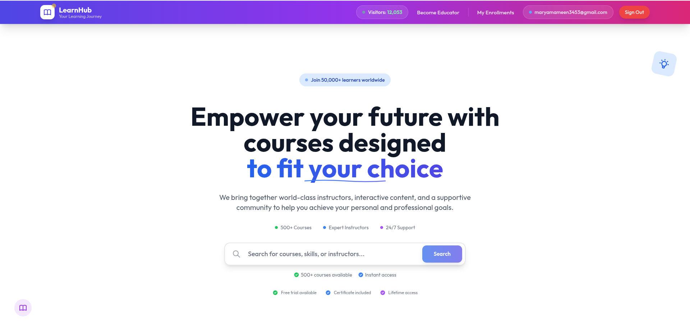
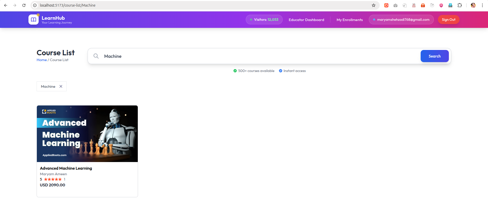
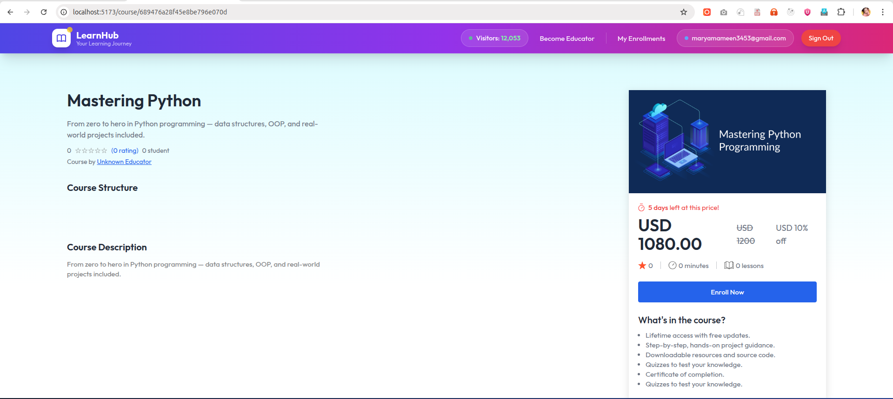
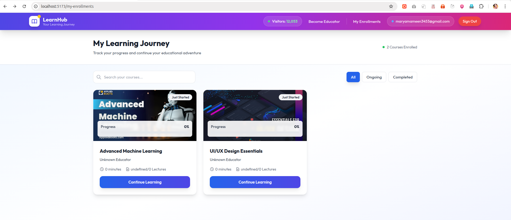
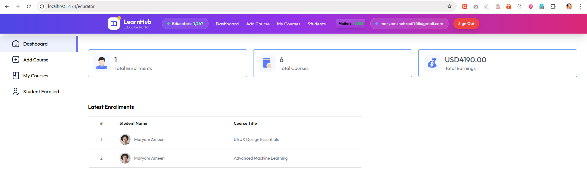
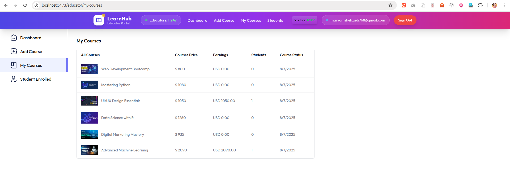
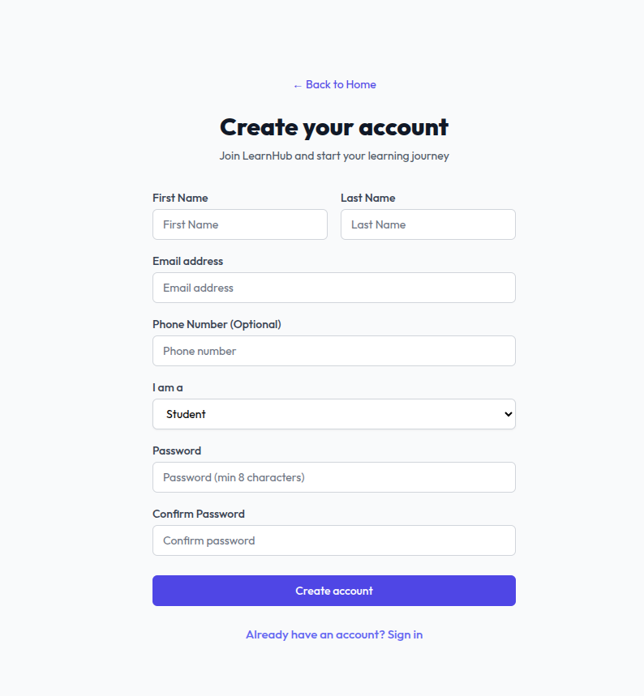
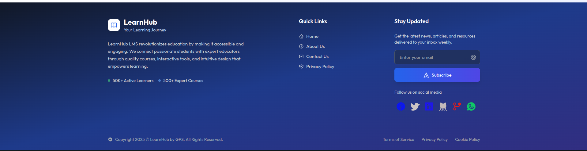

<div align="center">
  
# 🎓 LearnHub LMS

**A Modern Learning Management System**

[](https://reactjs.org/)
[](https://nodejs.org/)
[](https://mongodb.com/)
[](https://tailwindcss.com/)
[](https://stripe.com/)

*A comprehensive e-learning platform built with modern web technologies*

[🚀 Live Demo](#) • [📖 Documentation](#) • [🐛 Report Bug](#) • [💡 Request Feature](#)

</div>

---

## ✨ Overview

LearnHub LMS is a full-stack learning management system that revolutionizes online education. It provides educators with powerful tools to create and manage courses, while offering students an engaging learning experience with progress tracking, video streaming, and interactive features.

### 🌟 Key Features

- **🎯 Course Management** - Create, edit, and manage comprehensive courses
- **👥 User Authentication** - Secure login with Supabase integration
- **📹 Video Streaming** - YouTube playlist integration for course content
- **📊 Progress Tracking** - Monitor student progress and completion rates
- **💳 Payment Processing** - Secure payments via Stripe integration
- **📱 Responsive Design** - Optimized for all devices and screen sizes
- **🎨 Modern UI/UX** - Beautiful interface with smooth animations
- **📈 Analytics Dashboard** - Comprehensive insights for educators

---

## 🛠️ Tech Stack

### **Frontend**
| Technology | Purpose |
|------------|---------|
|  | UI Framework |
|  | Build Tool |
|  | Styling |
|  | Animations |
|  | HTTP Client |

### **Backend**
| Technology | Purpose |
|------------|---------|
|  | Runtime Environment |
|  | Web Framework |
|  | Database |
|  | ODM |

### **Services**
| Service | Purpose |
|---------|---------|
|  | Authentication |
|  | Payment Processing |
|  | Media Storage |

---

## 📁 Project Structure

```
📦 LearnHub-LMS
├── 📂 client/                 # Frontend React Application
│   ├── 📂 src/
│   │   ├── 📂 components/     # Reusable UI Components
│   │   │   ├── 📂 educator/   # Educator-specific components
│   │   │   └── 📂 student/    # Student-specific components
│   │   ├── 📂 pages/          # Page Components
│   │   │   ├── 📂 educator/   # Educator pages
│   │   │   └── 📂 student/    # Student pages
│   │   ├── 📂 context/        # React Context Providers
│   │   ├── 📂 assets/         # Static assets
│   │   └── 📂 config/         # Configuration files
│   ├── 📜 package.json
│   └── 📜 vite.config.js
│
├── 📂 server/                 # Backend Node.js Application
│   ├── 📂 controllers/        # Route controllers
│   ├── 📂 models/             # Database models
│   ├── 📂 routes/             # API routes
│   ├── 📂 middlewares/        # Custom middlewares
│   ├── 📂 configs/            # Configuration files
│   └── 📜 server.js
│
└── 📜 README.md
```

---

## 🚀 Quick Start

### Prerequisites
- Node.js (v16 or higher)
- MongoDB
- Supabase account
- Stripe account
- Cloudinary account

### Installation

1. **Clone the repository**
   ```bash
   git clone https://github.com/engmaryamameen/LearnHub-LMS.git
   cd LearnHub-LMS
   ```

2. **Install dependencies**
   ```bash
   # Install frontend dependencies
   cd client
   npm install
   
   # Install backend dependencies
   cd ../server
   npm install
   ```

3. **Environment Setup**
   
   Create `.env` files in both `client/` and `server/` directories:
   
   **Frontend (.env)**
   ```env
   VITE_BACKEND_URL=http://localhost:3000
   VITE_SUPABASE_URL=your_supabase_url
   VITE_SUPABASE_ANON_KEY=your_supabase_anon_key
   ```
   
   **Backend (.env)**
   ```env
   PORT=3000
   MONGODB_URI=your_mongodb_connection_string
   SUPABASE_URL=your_supabase_url
   SUPABASE_KEY=your_supabase_service_key
   STRIPE_SECRET_KEY=your_stripe_secret_key
   CLOUDINARY_CLOUD_NAME=your_cloudinary_cloud_name
   CLOUDINARY_API_KEY=your_cloudinary_api_key
   CLOUDINARY_API_SECRET=your_cloudinary_api_secret
   ```

4. **Run the application**
   ```bash
   # Start backend server
   cd server
   npm start
   
   # Start frontend development server
   cd ../client
   npm run dev
   ```

5. **Access the application**
   - Frontend: http://localhost:5173
   - Backend API: http://localhost:3000

---

## 🎯 Features in Detail

### 👨‍🏫 **For Educators**
- **Course Creation**: Create comprehensive courses with chapters and lectures
- **Content Management**: Upload course thumbnails and organize content
- **Student Analytics**: Track enrollment, progress, and engagement
- **Revenue Tracking**: Monitor earnings and payment status
- **YouTube Integration**: Add playlist links for additional content

### 👨‍🎓 **For Students**
- **Course Discovery**: Browse and search available courses
- **Enrollment System**: Easy course enrollment with secure payments
- **Progress Tracking**: Monitor learning progress and completion
- **Video Learning**: Stream course content with embedded players
- **Personal Dashboard**: View enrolled courses and achievements

### 🔧 **Technical Features**
- **Real-time Updates**: Live progress tracking and notifications
- **Secure Authentication**: JWT-based authentication with Supabase
- **Payment Processing**: Secure payment handling with Stripe
- **File Management**: Cloud storage for course materials
- **Responsive Design**: Optimized for desktop, tablet, and mobile

---

## 📸 Screenshots

<div align="center">

### 🏠 Home Page


### 🔍 Search Functionality


### 📚 Course Details


### 🎓 Student Enrolled Courses


### 👨‍🏫 Educator Dashboard


### 📝 Educator Course List


### 📝 Sign Up Page


### 🦶 Footer


</div>

---

## 🔧 API Endpoints

### Authentication
- `POST /api/user/register` - User registration
- `POST /api/user/login` - User login
- `GET /api/user/profile` - Get user profile

### Courses
- `GET /api/course/all` - Get all courses
- `GET /api/course/:id` - Get course details
- `POST /api/course/add` - Add new course (Educator only)
- `PUT /api/course/:id` - Update course (Educator only)

### User Management
- `GET /api/user/enrolled-courses` - Get user's enrolled courses
- `POST /api/user/purchase-course` - Purchase a course
- `POST /api/user/update-course-progress` - Update course progress

### Educator Features
- `GET /api/educator/courses` - Get educator's courses
- `GET /api/educator/dashboard` - Get dashboard data
- `GET /api/educator/enrolled-students` - Get enrolled students

---

## 🚀 Deployment

### Frontend Deployment (Vercel)
```bash
cd client
vercel --prod
```

### Backend Deployment (Vercel)
```bash
cd server
vercel --prod
```

### Environment Variables
Make sure to set all required environment variables in your deployment platform.

---

## 🤝 Contributing

We welcome contributions! Please follow these steps:

1. Fork the repository
2. Create a feature branch (`git checkout -b feature/AmazingFeature`)
3. Commit your changes (`git commit -m 'Add some AmazingFeature'`)
4. Push to the branch (`git push origin feature/AmazingFeature`)
5. Open a Pull Request

### Development Guidelines
- Follow the existing code style
- Add comments for complex logic
- Test your changes thoroughly
- Update documentation if needed

---

## 📝 License

This project is licensed under the MIT License - see the [LICENSE](LICENSE) file for details.

---

##  Acknowledgments

- [React](https://reactjs.org/) - Frontend framework
- [Node.js](https://nodejs.org/) - Backend runtime
- [MongoDB](https://mongodb.com/) - Database
- [Supabase](https://supabase.com/) - Authentication
- [Stripe](https://stripe.com/) - Payment processing
- [Tailwind CSS](https://tailwindcss.com/) - Styling framework

---

<div align="center">

---
## ⭐ Support
Give a ⭐ if you like this project!

**Made with ❤️ by Maryam Ameen for Developer Comunity**

[](https://github.com/yourusername/LearnHub-LMS)
[](https://github.com/yourusername/LearnHub-LMS)
[](https://github.com/yourusername/LearnHub-LMS/issues)

</div>
